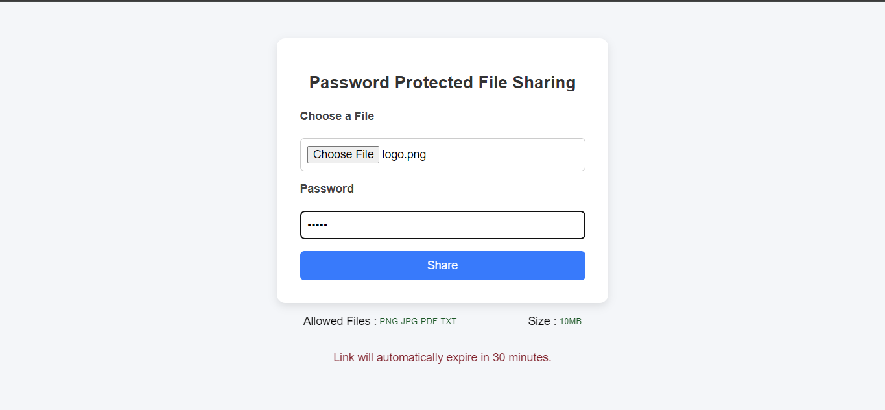
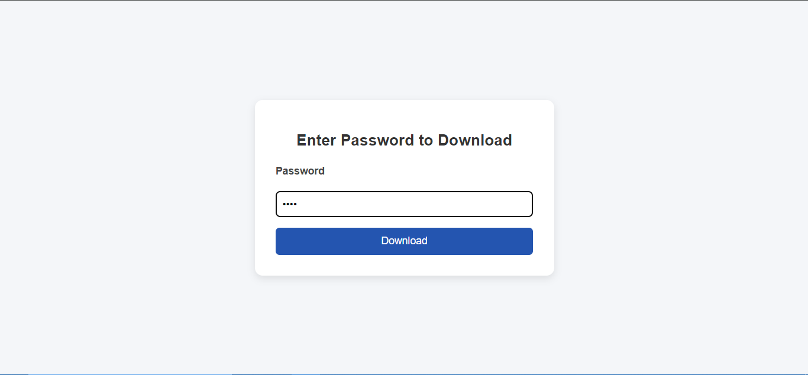

# Shareit

**A password protected file sharing website built with Node.js, Express, and MongoDB and several npm packages.**

---

## Features

- Upload files with password
- Share link and password to others
- Encrypted files are downloaded after password is provided
- 10 mb size limit is set per file
- Only png,jpeg,pdf and txt files are allowed
- Files expire after 30 min and are unaccessible
- Expired files are cleaned once every hour
- clean and minimal interface
- Deployed online for live access

---

## Tech Stack

- **Backend:** Node.js, Express.js
- **Frontend:** EJS,
- **Database:** MongoDB
- **Deployment:** Vercel
- **Other NPM packages:** axios, bcrypt, cloudinary, multer, node-cron.

### Why ?

- bcrypt for hashing password before saving to database
- multer to get & store files on server temperairly
- cloudinary to store files
- node-cron to delete expired files from database and cloudinary once every hour (expired files are unaccessible)

---

## Installation

1. Clone the repository:

```bash
git clone https://github.com/Mudasirh120/PasswordProtectedFileSharing.git
```

2. Install dependencies:

```bash
npm install
```

3. Create a `.env` file and add these variables:

```
MONGODB_URL=your_mongodb_connection_string
PORT=5001
CLOUDINARY_CLOUDNAME="your_cloudinary_cloudname"
CLOUDINARY_APIKEY="your_cloudinary_apikey"
CLOUDINARY_SECRET="your_cloudinary_secret"

```

4. Start the server:

```bash
npm run dev
```

5. Open `http://localhost:5001` in your browser.

---

## Usage

1. Upload a file
2. Set a password if you want
3. Click “Share”
4. Copy the generated link and share it

---

## Screenshots





---

**Eror Messages**


